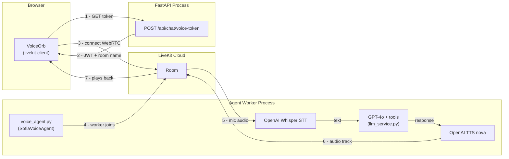

# LiveKit Voice AI — Sofia

## Current State vs Target

**Current:** `SpeechRecognition` (browser) → REST `/chat/messages` → REST `/chat/tts` → `Audio()` playback

**Target:** WebRTC room → LiveKit Agent (server-side STT → GPT-4o → OpenAI TTS) → audio back to browser

This is faster (no round-trip text encoding), more robust (handles interruptions, turn detection), and works even where browser `SpeechRecognition` is blocked.

## Architecture




## Stack — No New API Keys Needed

- STT: `livekit-plugins-openai` (Whisper) — uses existing `OPENAI_API_KEY`
- LLM: GPT-4o with existing `sofia_system.txt` + tool functions
- TTS: `livekit-plugins-openai` (TTS nova) — uses existing `OPENAI_API_KEY`
- Transport: LiveKit Cloud — uses existing `LIVEKIT_*` env vars

## Files Changed

**Backend — 5 files:**

- `[backend/requirements.txt](backend/requirements.txt)` — add `livekit-agents`, `livekit-plugins-openai`
- `[backend/app/agents/voice_agent.py](backend/app/agents/voice_agent.py)` (**NEW**) — `SofiaVoiceAgent` class: wires OpenAI STT + GPT-4o + OpenAI TTS, reuses `sofia_system.txt` prompt and the tool-calling logic from `llm_service.py`
- `[backend/app/services/voice_service.py](backend/app/services/voice_service.py)` (**NEW**) — `create_voice_token(session_id)` using `livekit-api` `AccessToken`
- `[backend/app/api/routes/chat.py](backend/app/api/routes/chat.py)` — add `POST /chat/voice-token` endpoint (returns `{ token, url, room_name }`)
- `[backend/voice_worker.py](backend/voice_worker.py)` (**NEW**) — standalone entry point: `python voice_worker.py dev` runs the agent worker, separate from the FastAPI process

**Frontend — 3 files:**

- `[frontend/package.json](frontend/package.json)` — add `livekit-client`, `@livekit/components-react`
- `[frontend/src/services/api.ts](frontend/src/services/api.ts)` — add `getVoiceToken(sessionId)`
- `[frontend/src/components/voice/VoiceOrb.tsx](frontend/src/components/voice/VoiceOrb.tsx)` — replace `SpeechRecognition` + `Audio()` with `Room` from `livekit-client`; use `useVoiceAssistant()` hook for state; keep existing 4-state UI (`idle/listening/thinking/speaking`) wired to LiveKit agent state

## VoiceOrb state mapping


| LiveKit agent state | Sofia expression | Orb UI           |
| ------------------- | ---------------- | ---------------- |
| `disconnected`      | `idle`           | static orb       |
| `connecting`        | `thinking`       | slow pulse       |
| `listening`         | `listening`      | fast green rings |
| `thinking`          | `thinking`       | dots animate     |
| `speaking`          | `speaking`       | waveform bars    |


## Dev Setup (after implementation)

Two terminals:

```bash
# Terminal 1 — FastAPI
cd backend && uvicorn app.main:app --reload --port 8000

# Terminal 2 — Voice Agent Worker
cd backend && python voice_worker.py dev
```

The agent worker connects to LiveKit Cloud and waits for rooms. When a user starts voice chat, the frontend calls `/voice-token`, gets a JWT, connects to the room, and the worker dispatches a `SofiaVoiceAgent` into that room automatically.